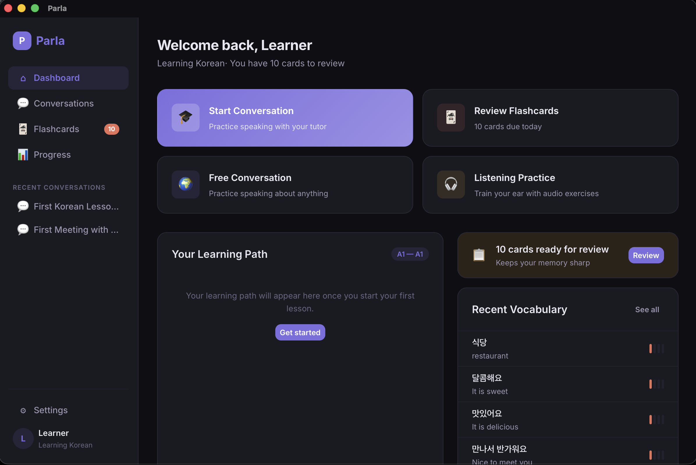
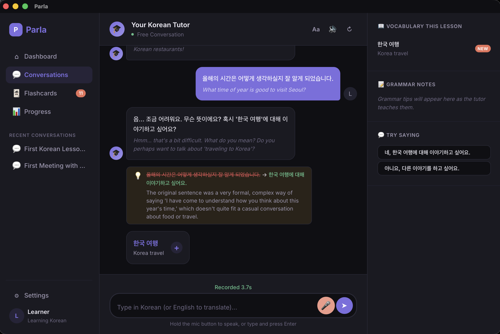
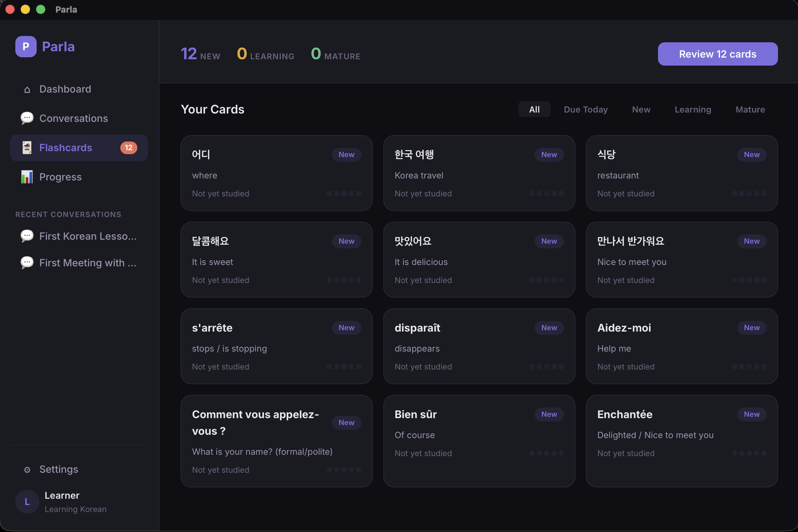
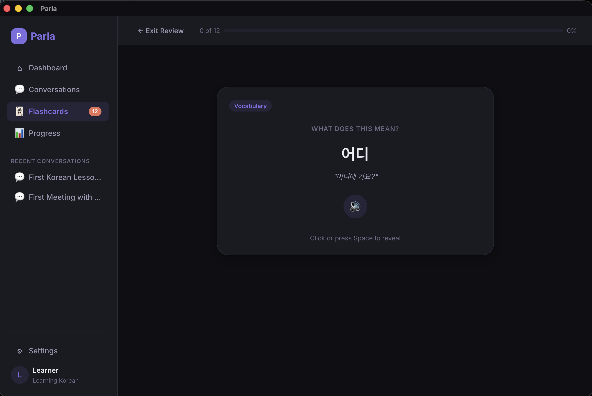
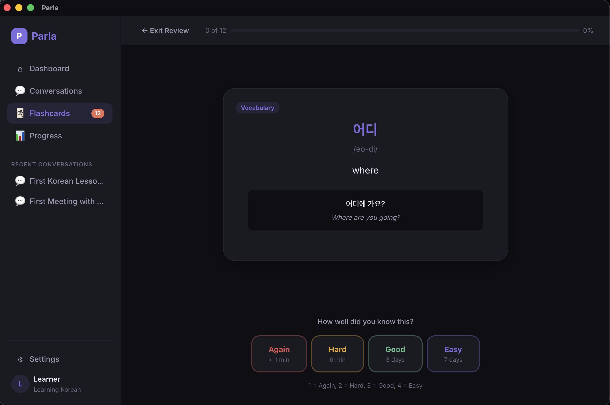

# Parla

Parla is a conversational language tutor that runs entirely on your machine. Instead of gamified drills, you learn by having real conversations with an AI tutor that adapts to your level, corrects your mistakes naturally, and tracks what you know.

All models run locally. Your conversations, progress, and data never leave your computer.











## How It Works

You choose a target language and tell the tutor what you're learning for (travel, work, culture, etc.). Then you have back-and-forth conversations — by typing or speaking — while the tutor plays roles (a waiter, a shopkeeper, a new friend) to create realistic situations.

What makes this different from chatting with a generic LLM:

- **Vocabulary highlighted in context** with translations available inline
- **Grammar taught in the moment** via a side panel that explains patterns as they appear
- **Gentle inline corrections** — the tutor shows the natural way to say something with a brief explanation
- **Suggested responses** when you're stuck, with translations, that fade as you progress
- **Voice input and output** — hold the mic button to speak, and the tutor speaks back
- **Spaced-repetition flashcards** generated from your actual conversations, not a generic word list
- **Progress tracking** mapped to the CEFR framework (A1–C2) across reading, listening, writing, and speaking

## Tech Stack

| Layer | Technology |
|-------|-----------|
| Desktop framework | [Tauri 2](https://v2.tauri.app/) (Rust) |
| Frontend | [SvelteKit 2](https://svelte.dev/) + TypeScript |
| LLM | [Gemma 4 26B-A4B](https://ai.google.dev/gemma) via [llama-server](https://github.com/ggml-org/llama.cpp) |
| Speech-to-text | [Whisper.cpp](https://github.com/ggerganov/whisper.cpp) (small model) |
| Text-to-speech | [Kokoro](https://huggingface.co/onnx-community/Kokoro-82M-v1.0-ONNX) (ONNX) |
| Voice activity detection | [Silero VAD](https://github.com/snakers4/silero-vad) (ONNX) |
| Database | SQLite |
| ML runtime | [ONNX Runtime](https://onnxruntime.ai/) |

## Hardware Requirements

Parla runs on **macOS with Apple Silicon** (M1 or later). The LLM uses Metal acceleration for inference.

| | Minimum | Recommended |
|--|---------|-------------|
| RAM | 32 GB | 64 GB+ |
| Disk | ~20 GB (models) | ~20 GB |
| macOS | 13 Ventura | 14 Sonoma+ |
| Chip | Apple M1 | Apple M1 Pro+ |

The Gemma 4 26B model is a mixture-of-experts architecture (25.2B total, 3.8B active) quantized to Q4_K_M (~15.5 GB on disk). It runs well on 32 GB machines thanks to Apple Silicon's unified memory.

## Prerequisites

- [Rust](https://rustup.rs/) (latest stable)
- [Node.js](https://nodejs.org/) (v18+)
- [llama-server](https://github.com/ggml-org/llama.cpp) — Parla manages it as a subprocess
  ```sh
  brew install llama.cpp
  ```
- (Optional) [espeak-ng](https://github.com/espeak-ng/espeak-ng) for Kokoro TTS phonemization
  ```sh
  brew install espeak-ng
  ```

## Setup

1. **Clone the repo and install dependencies:**

   ```sh
   git clone https://github.com/joedursun/parla.git
   cd parla
   npm install
   ```

2. **Download models:**

   The setup script downloads all required models (~16.5 GB total, or ~500 MB without the LLM):

   ```sh
   ./setup.sh
   ```

   Models are stored in `~/Library/Application Support/com.parla.app/models/`. The script is idempotent — safe to re-run.

   If you already have the Gemma GGUF in your Hugging Face cache (e.g. from using llama-server directly), the script will detect it and create a copy using APFS clonefile (near-instant, no extra disk usage).

   To skip the large LLM download and handle it separately:

   ```sh
   PARLA_SKIP_LLM=1 ./setup.sh
   ```

3. **Run the app:**

   ```sh
   cargo tauri dev
   ```

## Project Structure

```
src/                  # SvelteKit frontend
src-tauri/
  src/
    audio/            # Audio capture, playback, resampling
    vad/              # Voice activity detection (Silero)
    stt/              # Speech-to-text (Whisper)
    tts/              # Text-to-speech (Kokoro)
    llm/              # LLM inference (llama-server management)
    db/               # SQLite persistence
    lib.rs            # Tauri commands & app state
```

## License

MIT
